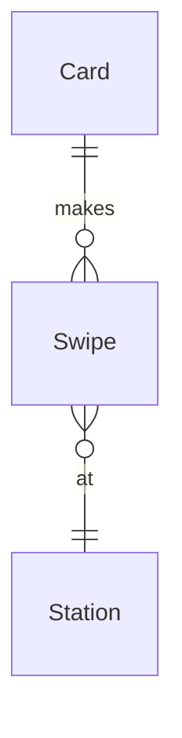

## [Cours 6](https://cs50.harvard.edu/sql/2024/notes/6/)

- [Introduction](#introduction)
- [MySQL](#mysql)
    - [Creating the `cards` Table](#creating-the-cards-table)
    - [Creating the `stations` Table](#creating-the-stations-table)
    - [Creating the `swipes` Table](#creating-the-swipes-table)
- [Altering Tables](#altering-tables)
- [Stored Procedures](#stored-procedures)
    - [Stored Procedures with Parameters](#stored-procedures-with-parameters)
- [PostgreSQL](#postgresql)
    - [Creating PostgreSQL Tables](#creating-postgresql-tables)
- [Scaling with MySQL](#scaling-with-mysql)
- [Access Controls](#access-controls)
- [SQL Injection Attacks](#sql-injection-attacks)
- [Fin](#fin)

## Introduction

- Jusqu'à présent dans ce cours, nous avons appris à concevoir et créer nos propres bases de données, à lire et écrire des données, et plus récemment, à optimiser nos requêtes. Maintenant, nous allons comprendre comment faire tout cela mais à plus grande échelle.
- La **scalabilité** (scalability) est la capacité d'augmenter ou de diminuer la capacité d'une application ou d'une base de données pour répondre à la demande.
- Les plateformes de médias sociaux et les systèmes bancaires sont des exemples d'applications qui peuvent avoir besoin de se développer à mesure qu'elles grandissent et gagnent plus d'utilisateurs.
- Dans cette conférence, nous utiliserons différents systèmes de gestion de bases de données comme MySQL et PostgreSQL, qui peuvent être utilisés pour mettre à l'échelle des bases de données.
- SQLite est une <u>base de données intégrée</u>, mais MySQL et PostgreSQL sont des <u>serveurs de bases de données</u> — ils fonctionnent souvent sur leur propre matériel dédié auquel nous pouvons nous connecter via Internet pour exécuter nos requêtes SQL. Cela leur confère l'avantage de pouvoir stocker leurs données en RAM, ce qui entraîne des requêtes plus rapides.


## Transition de SQLite vers les bases de données client/serveur

- SQLite, que nous avons utilisé jusqu'à présent, est une base de données **intégrée** : elle fonctionne comme une bibliothèque liée directement à l'application, sans processus serveur distinct.
- MySQL et PostgreSQL fonctionnent selon un modèle **client/serveur** : un processus serveur dédié gère la base de données, tandis que les applications s'y connectent en tant que clients.
- Cette différence architecturale a plusieurs implications importantes :

  | Caractéristique | SQLite | MySQL/PostgreSQL |
    |-----------------|--------|------------------|
  | Installation | Simple, fichier unique | Nécessite installation et configuration d'un serveur |
  | Concurrence | Limitée (verrous au niveau fichier) | Avancée (gestion fine des transactions) |
  | Mémoire | Utilise la mémoire de l'application | Utilise sa propre mémoire, configurable |
  | Performance | Excellente pour les petites charges | Supérieure pour les charges importantes |
  | Administration | Minimale | Nécessite une gestion active (utilisateurs, sécurité, etc.) |
  | Réseau | Local uniquement | Accessible à distance via le réseau |

- Le modèle client/serveur permet des fonctionnalités avancées :
    - **Mise en cache** : Stockage des données fréquemment utilisées en RAM pour un accès ultra-rapide
    - **Connexions multiples** : Centaines voire milliers de connexions simultanées
    - **Sécurité réseau** : Contrôle d'accès granulaire, SSL/TLS pour les connexions
    - **Haute disponibilité** : Réplication, clustering, basculement automatique

- Ces différences expliquent pourquoi les applications professionnelles adoptent généralement MySQL ou PostgreSQL lorsqu'elles dépassent un certain niveau de complexité ou d'utilisation.érences expliquent pourquoi les applications professionnelles adoptent généralement MySQL ou PostgreSQL lorsqu'elles dépassent un certain niveau de complexité ou d'utilisation.

## MySQL

- Nous allons utiliser la base de données MBTA avec laquelle nous avons travaillé dans les cours précédents. Le diagramme ER suivant montre les entités Card (Carte), Swipe (Passage) et Station (Station) et les relations entre ces entités.




- Pour rappel, les usagers du métro utilisent une CharlieCard qu'ils passent dans les stations pour entrer. Les usagers peuvent recharger leurs cartes et, dans certains cas, doivent passer leurs cartes pour quitter une station. La MBTA ne stocke pas d'informations sur les usagers, mais suit uniquement les cartes.
- Nous voulons créer une base de données dans MySQL avec ce schéma ! Dans le terminal, connectons-nous à un serveur MySQL.

  ```bash
  mysql -u root -h 127.0.0.1 -P 3306 -p
  ```

- Dans cette commande de terminal, `-u` indique l'utilisateur. Nous fournissons l'utilisateur auquel nous voulons nous connecter à la base de données en tant que `root` (synonyme d'administrateur de base de données, dans ce cas).
    - `127.0.0.1` est l'adresse de l'hôte local sur Internet (notre propre ordinateur).
    - `3306` est le port auquel nous voulons nous connecter, et c'est le port par défaut où MySQL est hébergé. Considérez la combinaison de l'hôte et du port comme l'adresse de la base de données à laquelle nous essayons de nous connecter !
    - `-p` à la fin de la commande indique que nous voulons être invités à saisir un mot de passe lors de la connexion.
- Étant donné qu'il s'agit d'un serveur de base de données complet avec potentiellement de nombreuses bases de données à l'intérieur. Pour afficher toutes les bases de données existantes, nous utilisons la commande MySQL suivante.

```sql
  SHOW DATABASES;
```

  Cela renvoie certaines bases de données par défaut déjà présentes dans le serveur.
- Nous allons effectuer quelques opérations pour configurer la base de données MBTA. Nous avons vu comment faire cela dans SQLite, alors concentrons-nous sur les différences de syntaxe pour MySQL !
- Création d'une nouvelle base de données :

```sql
  CREATE DATABASE `mbta`;
```

Au lieu de guillemets, nous utilisons des accents graves pour identifier le nom de la table et d'autres variables dans nos instructions SQL.
- Pour changer la base de données actuelle en `mbta` :


```sql
  USE `mbta`;
```


## Creating the `cards` Table

- MySQL offre une granularité plus fine avec les types que SQLite. Par exemple, un entier (integer) pourrait être `TINYINT`, `SMALLINT`, `MEDIUMINT`, `INT` ou `BIGINT` en fonction de la taille du nombre que nous voulons stocker. Le tableau suivant nous montre la taille et la plage des nombres que nous pouvons stocker dans chacun des types d'entiers.

  [Tableau des types d'entiers dans MySQL]

  Ces plages supposent que nous voulons utiliser un entier signé. Si nous utilisons des entiers non signés, la valeur maximale que nous pourrions stocker avec chaque type d'entier serait doublée.
- Créons maintenant la table `cards` en utilisant un type de données `INT` pour la colonne ID. Puisqu'un `INT` peut stocker un nombre jusqu'à 4 milliards, il devrait être suffisamment grand pour notre cas d'utilisation !

  ```sql
  CREATE TABLE `cards` (
      `id` INT AUTO_INCREMENT,
      PRIMARY KEY(`id`)
  );
  ```

  Notez que nous utilisons le mot-clé `AUTO_INCREMENT` avec l'ID afin que MySQL insère automatiquement le nombre suivant comme ID pour une nouvelle ligne.

### Questions

> L'ID ne devrait-il pas être un entier non signé ? Comment pouvons-nous l'indiquer ?

- Oui, nous pourrions explicitement faire de l'ID un entier non signé en ajoutant le mot-clé `UNSIGNED` lors de la création de l'entier.

## Creating the `stations` Table

- Après avoir créé la table, nous pouvons voir une liste des tables existantes en exécutant :

  ```sql
  SHOW TABLES;
  ```
- Pour plus de détails sur une table, nous pouvons utiliser la commande `DESCRIBE`.

  ```sql
  DESCRIBE `cards`;
  ```
- Pour gérer le texte, MySQL propose de nombreux types. Deux types couramment utilisés sont `CHAR` — une chaîne de largeur fixe, et `VARCHAR` — une chaîne de longueur variable. MySQL dispose également d'un type `TEXT` mais contrairement à SQLite, ce type est utilisé pour des morceaux de texte plus longs comme des paragraphes, des pages de livres, etc. En fonction de la longueur du texte, il pourrait être l'un des types suivants : `TINYTEXT`, `TEXT`, `MEDIUMTEXT` et `LONGTEXT`. De plus, nous avons le type `BLOB` pour stocker des chaînes binaires.
- MySQL fournit également deux autres types de texte : `ENUM` et `SET`. Enum restreint une colonne à une seule option prédéfinie parmi une liste d'options que nous fournissons. Par exemple, les tailles de t-shirts pourraient être énumérées en M, L, XL, etc. Un ensemble permet de stocker plusieurs options dans une seule cellule, utile pour des scénarios comme les genres de films.
- Créons maintenant la table `stations` dans MySQL.

  ```sql
  CREATE TABLE `stations` (
      `id` INT AUTO_INCREMENT,
      `name` VARCHAR(32) NOT NULL UNIQUE,
      `line` ENUM('blue', 'green', 'orange', 'red') NOT NULL,
      PRIMARY KEY(`id`)
  );
  ```

    - Nous choisissons un `VARCHAR` pour le nom de la station car les noms peuvent avoir une longueur inconnue. La ligne sur laquelle se trouve une station, cependant, est l'une des lignes de métro existantes à Boston. Puisque nous connaissons les valeurs que cela peut prendre, nous pouvons utiliser un type `ENUM`.
    - Nous utilisons également les contraintes de colonne `UNIQUE` et `NOT NULL` de la même manière que nous l'avons fait avec SQLite.
- En exécutant la commande pour décrire cette table, nous voyons une sortie similaire qui répertorie chacune des colonnes de la table. Dans le champ `Key`, la clé primaire est reconnue par `PRI` et toute colonne avec des valeurs uniques est reconnue par `UNI`. Le champ `NULL` nous indique quelles colonnes permettent des valeurs `NULL`, ce que aucune des colonnes ne fait pour la table `stations`.

### Questions

> Peut-on utiliser une table comme entrée pour `ENUM` ?

- Cela pourrait être possible en utilisant une instruction `SELECT` imbriquée, mais ce n'est peut-être pas une bonne idée si les valeurs de la table changent avec le temps. Il pourrait être préférable d'indiquer explicitement les valeurs comme options pour `ENUM`.

> Si nous ne savons pas combien de temps un morceau de texte sera et que nous utilisons quelque chose comme `VARCHAR(300)` pour le représenter, est-ce correct ?

- Bien que cela soit correct, il y a un compromis ici. Nous perdrons 300 octets de mémoire pour chaque ligne de données insérée, ce qui pourrait ne pas en valoir la peine si nous finissons par stocker uniquement des chaînes très courtes. Il pourrait être préférable de commencer avec une longueur plus courte, puis de modifier la table pour augmenter la longueur si nécessaire.

## Creating the `swipes` Table

- MySQL nous propose quelques options pour stocker les dates et les heures, alors qu'elles devaient être stockées à l'aide du type numérique dans SQLite.
- Nous pourrions utiliser `DATE`, `YEAR`, `TIME`, `DATETIME` et `TIMESTAMP` (pour des temps plus précis) pour stocker nos valeurs de date et d'heure. Les trois derniers permettent un paramètre facultatif pour spécifier la précision avec laquelle nous voulons stocker l'heure.
- Dans SQLite, nous avions un type de données `REAL`. Ici, nos options sont `FLOAT` et `DOUBLE PRECISION` comme montré dans le tableau ci-dessous.

  [Types de données réels dans MySQL]

- La quantité de précision doit être spécifiée avec le nombre d'octets, en raison de l'imprécision des nombres à virgule flottante. Cela signifie qu'avec une quantité limitée de mémoire, les nombres à virgule flottante ne peuvent être représentés qu'avec une certaine précision. Plus il y a d'octets, plus la précision avec laquelle le nombre est représenté est grande.
- Il existe également un moyen dans MySQL d'utiliser un type décimal (précision fixe). Avec cela, nous spécifierions le nombre de chiffres dans le nombre à représenter, et le nombre de chiffres après la virgule décimale.
- Créons maintenant la table `swipes`.

  ```sql
  CREATE TABLE `swipes` (
      `id` INT AUTO_INCREMENT,
      `card_id` INT,
      `station_id` INT,
      `type` ENUM('enter', 'exit', 'deposit') NOT NULL,
      `datetime` DATETIME NOT NULL DEFAULT CURRENT_TIMESTAMP,
      `amount` DECIMAL(5,2) NOT NULL CHECK(`amount` != 0),
      PRIMARY KEY(`id`),
      FOREIGN KEY(`station_id`) REFERENCES `stations`(`id`),
      FOREIGN KEY(`card_id`) REFERENCES `cards`(`id`)
  );
  ```

    - Remarquez l'utilisation de `DEFAULT CURRENT_TIMESTAMP` pour indiquer que l'horodatage doit être automatiquement rempli pour stocker l'heure actuelle si aucune valeur n'est fournie.
    - La précision que nous choisissons pour le montant du passage est de 2. Cela garantit que les centimes sont ajoutés ou soustraits sans aucun arrondi.
    - Les contraintes de colonne de lorsque nous avons créé la table dans SQLite restent, y compris la vérification pour s'assurer que le montant du passage n'est pas négatif.
- Si nous décrivons cette table après l'avoir créée, nous verrons une sortie familière. Le champ `Key` a une nouvelle valeur, `MUL` (multiple) pour les colonnes de clé étrangère, indiquant qu'elles pourraient avoir des valeurs répétées puisqu'elles sont des clés étrangères.

### Questions

> Lorsque nous ajoutons des contraintes à une colonne, y a-t-il une précédence avec laquelle elles prennent effet ?

- Non, les contraintes fonctionnent ensemble de manière combinée. MySQL nous permet d'ajouter des contraintes dans n'importe quel ordre lors de la création de la table.

> MySQL a-t-il des affinités de type ?

- Pas exactement. MySQL a des types de données, comme `INT` et `VARCHAR`, mais contrairement à SQLite, il ne nous permettra pas d'entrer des données d'un type différent et d'essayer de les convertir.

## Altering Tables

- MySQL nous permet de modifier les tables plus fondamentalement que SQLite.
- Si nous voulions ajouter une ligne argentée (silver line) aux lignes possibles sur lesquelles une station pourrait se trouver, nous pouvons faire ce qui suit.

  ```sql
  ALTER TABLE `stations`
  MODIFY `line` ENUM('blue', 'green', 'orange', 'red', 'silver') NOT NULL;
  ```

    - Cela nous permet de modifier la colonne `line` et de changer son type, de sorte que l'`ENUM` inclut désormais l'argenté comme option.
    - Notez également que nous utilisons le mot-clé `MODIFY` en plus de la construction `ALTER TABLE` à laquelle nous sommes habitués avec SQLite.

## Stored Procedures

- Les procédures stockées sont un moyen d'automatiser les instructions SQL et de les exécuter de manière répétée.
- Pour démontrer les procédures stockées, nous utiliserons une base de données d'une conférence précédente — la base de données MFA de Boston.
- Rappelez-vous que nous avons utilisé des vues dans SQLite pour implémenter une fonctionnalité de suppression logicielle pour les `collections` dans la base de données MFA. Une vue `current_collections` affichait toutes les collections non marquées comme supprimées. Nous allons maintenant utiliser une procédure stockée dans MySQL pour faire quelque chose de similaire.
- Naviguons vers la base de données MFA déjà créée sur notre serveur MySQL.

  ```sql
  USE `mfa`;
  ```
- En décrivant la table `collections`, nous voyons que la colonne `deleted` n'est pas présente et doit être ajoutée à la table.

  ```sql
  ALTER TABLE `collections`
  ADD COLUMN `deleted` TINYINT DEFAULT 0;
  ```

  Étant donné que la colonne `deleted` n'a que des valeurs de 0 ou 1, il est sûr d'utiliser un `TINYINT`. Nous définissons également la valeur par défaut sur 0 car nous voulons conserver toutes les collections déjà présentes dans la table.
- Avant de créer une procédure stockée, nous devons changer le délimiteur de `;` à autre chose. Contrairement à SQLite, où nous pouvions taper plusieurs instructions entre un `BEGIN` et un `END` (ce dont nous avons besoin pour une procédure stockée ici) et les terminer par un `;`, MySQL met fin prématurément à l'instruction lorsqu'il rencontre un `;`.

  ```sql
  delimiter //
  ```
- Maintenant, nous écrivons la procédure stockée.

  ```sql
  CREATE PROCEDURE `current_collection`()
  BEGIN
      SELECT `title`, `accession_number`, `acquired`
      FROM `collections`
      WHERE `deleted` = 0;
  END//
  ```

  Remarquez l'utilisation de parenthèses vides à côté du nom de la procédure, peut-être réminiscent des fonctions dans d'autres langages de programmation. De manière similaire aux fonctions, nous pouvons également appeler des procédures stockées pour les exécuter.
- Après avoir créé cela, nous devons réinitialiser le délimiteur sur `;`.

  ```sql
  delimiter ;
  ```
- Essayons d'appeler cette procédure pour voir les collections actuelles. À ce stade, la requête devrait afficher toutes les lignes de la table `collections` car nous n'avons encore rien supprimé logiquement.

  ```sql
  CALL current_collection();
  ```
- Si nous supprimons logiquement « Farmers working at dawn » et appelons à nouveau la procédure, nous constaterons que la ligne supprimée n'est pas incluse dans la sortie.

  ```sql
  UPDATE `collections`
  SET `deleted` = 1
  WHERE `title` = 'Farmers working at dawn';
  ```

### Questions

> Pouvons-nous ajouter des paramètres aux procédures stockées, c'est-à-dire les appeler avec une certaine entrée ?

- Oui, nous le pouvons et nous verrons un exemple bientôt !

> Pouvons-nous appeler une procédure depuis une autre, comme avec les fonctions ?

- Oui. Vous pourriez mettre à peu près n'importe quelle instruction SQL que vous écrivez dans une procédure également.

> Peut-on laisser des notes ou des commentaires dans les tables dans MySQL ?

- Cela pourrait certainement être une fonctionnalité utile ! Vous pourriez laisser des commentaires dans un fichier `schema.sql` décrivant l'intention derrière différentes parties du schéma, mais il pourrait également y avoir des moyens d'ajouter des commentaires dans les tables SQL.

## Stored Procedures with Parameters

- Lorsque nous avons précédemment travaillé avec la base de données MFA, nous avions une table appelée `transactions` pour enregistrer l'achat ou la vente d'œuvres d'art, que nous pouvons également créer ici.

  ```sql
  CREATE TABLE `transactions` (
      `id` INT AUTO_INCREMENT,
      `title` VARCHAR(64) NOT NULL,
      `action` ENUM('bought', 'sold') NOT NULL,
      PRIMARY KEY(`id`)
  );
  ```
- Maintenant, si une œuvre d'art est supprimée de `collections` parce qu'elle est vendue, nous voudrions également mettre à jour cela dans la table `transactions`. Habituellement, cela nécessiterait deux requêtes différentes, mais avec une procédure stockée, nous pouvons donner un nom à cette séquence.

  ```sql
  delimiter //
  CREATE PROCEDURE `sell`(IN `sold_id` INT)
  BEGIN
      UPDATE `collections` SET `deleted` = 1
      WHERE `id` = `sold_id`;
      INSERT INTO `transactions` (`title`, `action`)
      VALUES ((SELECT `title` FROM `collections` WHERE `id` = `sold_id`), 'sold');
  END//
  delimiter ;
  ```

  Le choix du paramètre pour cette procédure est l'ID du tableau ou de l'œuvre d'art car c'est un identifiant unique.
- Nous pouvons maintenant appeler la procédure pour vendre un article particulier. Supposons que nous voulons vendre « Imaginative landscape ».

  ```sql
  CALL `sell`(2);
  ```
- Nous pouvons afficher les données des tables `collections` et `transactions` pour vérifier que les modifications ont été effectuées.
- Que se passe-t-il si j'appelle `sell` sur le même ID plus d'une fois ? Il y a un danger qu'il soit ajouté plusieurs fois à la table `transactions`. Les procédures stockées peuvent être considérablement améliorées en logique et en complexité en utilisant certains constructs de programmation classiques. La liste suivante contient quelques constructs populaires disponibles dans MySQL.

  [Constructs de programmation dans MySQL]

## MariaDB : Alternative à MySQL

- **Origine** : MariaDB est un fork de MySQL créé en 2009 par Michael "Monty" Widenius, le fondateur original de MySQL, suite au rachat de MySQL par Oracle.
- **Compatibilité** : MariaDB est hautement compatible avec MySQL, ce qui permet une migration relativement simple. Les commandes SQL, les APIs et les structures sont largement identiques.
- **Différences principales avec MySQL** :
    - **Licences** : MariaDB est sous licence GPL v2, garantissant qu'elle restera toujours open-source, tandis que MySQL propose à la fois des versions communautaires et des versions propriétaires.
    - **Moteurs de stockage** : MariaDB inclut des moteurs supplémentaires comme Aria, ColumnStore (pour l'analytique) et Spider (pour le sharding).
    - **Fonctionnalités** : MariaDB a ajouté certaines fonctionnalités avant MySQL, comme les tables système en JSON, des améliorations de réplication et une meilleure optimisation des requêtes.
    - **Transparence** : Le développement de MariaDB est plus ouvert, avec une feuille de route publique et un processus communautaire.

- **Performance** : Dans certains benchmarks, MariaDB surpasse MySQL, particulièrement pour les charges de travail mixtes lecture/écriture.
- **Adoption** : De nombreuses distributions Linux (comme Debian et RHEL) ont remplacé MySQL par MariaDB comme système de gestion de base de données par défaut.
- **Migration** : La migration de MySQL vers MariaDB est généralement simple :
  ```bash
  mysqldump -u root -p --all-databases > sauvegarde_mysql.sql
  # Après installation de MariaDB
  mysql -u root -p < sauvegarde_mysql.sql
  ```

- Dans nos exercices pratiques, la plupart des commandes SQL fonctionneront de manière identique entre MySQL et MariaDB, ce qui facilite la transition entre ces systèmes.

## PostgreSQL

- Jusqu'à présent dans cette conférence, nous avons vu comment utiliser MySQL, ce qui nous donne une certaine capacité à évoluer par rapport à ce que SQLite peut offrir.
- Nous allons maintenant explorer les fonctionnalités de PostgreSQL en suivant le même processus que nous avons fait avec MySQL. Nous allons travailler avec certaines bases de données SQLite existantes et les convertir en PostgreSQL.
- Revenons à la base de données MBTA qui avait une table `cards`, voyons quels types de données sont disponibles pour nous dans PostgreSQL.
    - Entiers (Integers)

      [Types d'entiers dans PostgreSQL]

      Nous pouvons observer qu'il y a moins d'options ici que MySQL. PostgreSQL fournit également des entiers non signés, similaires à MySQL. Cela signifierait que le double de la valeur maximale affichée ici pourrait être stocké dans chaque type d'entier lorsque vous travaillez avec des entiers non signés.
    - Sériels (Serials)
        - Les sériels sont également des entiers, mais ce sont des numéros de série, généralement utilisés pour les clés primaires.
- Connectons-nous au serveur de base de données en ouvrant PSQL — l'interface de ligne de commande pour PostgreSQL.

  ```bash
  psql postgresql://postgres@127.0.0.1:5432/postgres
  ```

  Nous pouvons nous connecter en tant qu'utilisateur Postgres par défaut ou administrateur.
- Pour afficher toutes les bases de données, nous pouvons exécuter `\\l` et cela affiche une liste.
- Pour créer la base de données MBTA, nous pouvons exécuter :

  ```sql
  CREATE DATABASE "mbta";
  ```
- Pour nous connecter à cette base de données spécifique, nous pouvons exécuter `\\c "mbta"`.
- Pour lister toutes les tables de la base de données, nous pouvons exécuter `\\dt`. Pour l'instant, cependant, nous ne verrons aucune table dans la base de données.
- Enfin, nous pouvons créer la table `cards`, comme proposé. Nous utilisons un type de données `SERIAL` pour la colonne ID.

  ```sql
  CREATE TABLE "cards" (
      "id" SERIAL,
      PRIMARY KEY("id")
  );
  ```
- Pour décrire une table dans PostgreSQL, nous pouvons utiliser une commande comme `\\d "cards"`. En exécutant cela, nous voyons certaines informations sur cette table mais dans un format légèrement différent de MySQL.

### Questions

> Comment savez-vous dans PostgreSQL si votre requête entraîne une erreur ?

- Si vous appuyez sur Entrée et que le serveur de base de données ne dit pas ptu, vous saurez qu'il pourrait y avoir une erreur. Il est également probable que PostgreSQL vous donne des messages d'erreur utiles pour vous orienter dans la bonne direction.

## Creating PostgreSQL Tables

- La table `stations` est créée de manière similaire à MySQL.

  ```sql
  CREATE TABLE "stations" (
      "id" SERIAL,
      "name" VARCHAR(32) NOT NULL UNIQUE,
      "line" VARCHAR(32) NOT NULL,
      PRIMARY KEY("id")
  );
  ```

  Nous pouvons utiliser `VARCHAR` de la même manière que dans MySQL. Pour simplifier, nous disons que la colonne `"line"` est également de type `VARCHAR`.
- Nous voulons créer la table `swipes` ensuite. Rappelez-vous que le type de passage peut marquer l'entrée, la sortie ou le dépôt de fonds dans la carte. De manière similaire à MySQL, nous pouvons utiliser un `ENUM` pour capturer ces options, mais nous ne l'incluons pas dans la définition de la colonne. Au lieu de cela, nous créons notre propre type.

  ```sql
  CREATE TYPE "swipe_type" AS ENUM('enter', 'exit', 'deposit');
  ```
- PostgreSQL dispose des types `TIMESTAMP`, `DATE`, `TIME` et `INTERVAL` pour représenter les valeurs de date et d'heure. `INTERVAL` est utilisé pour capturer la durée de quelque chose ou la distance entre les heures. De manière similaire à MySQL, nous pouvons spécifier la précision avec ces types.
- Une différence clé avec les types de nombres réels dans PostgreSQL est que le type `DECIMAL` s'appelle `NUMERIC`.
- Nous pouvons maintenant créer la table `swipes` comme suit.

  ```sql
  CREATE TABLE "swipes" (
      "id" SERIAL,
      "card_id" INT,
      "station_id" INT,
      "type" "swipe_type" NOT NULL,
      "datetime" TIMESTAMP NOT NULL DEFAULT now(),
      "amount" NUMERIC(5,2) NOT NULL CHECK("amount" != 0),
      PRIMARY KEY("id"),
      FOREIGN KEY("station_id") REFERENCES "stations"("id"),
      FOREIGN KEY("card_id") REFERENCES "cards"("id")
  );
  ```

  Pour l'horodatage par défaut, nous utilisons une fonction fournie par PostgreSQL appelée `now()` qui nous donne l'horodatage actuel !
- Pour quitter PostgreSQL, nous utilisons la commande `\\q`.

## Scaling with MySQL

- Considérons un serveur de base de données pour une application dont la demande augmente. À mesure que le nombre de lectures et d'écritures provenant de l'application commence à augmenter, le temps d'attente pour que les requêtes soient traitées par le serveur augmente également.
- Une approche ici consiste à mettre à l'échelle la base de données verticalement. La mise à l'échelle verticale consiste à augmenter la capacité en augmentant la puissance de calcul du serveur de base de données.
- Une autre approche consiste à mettre à l'échelle horizontalement. Cela signifie augmenter la capacité en répartissant la charge sur plusieurs serveurs. Lorsque nous mettons à l'échelle horizontalement, nous conservons des copies de notre base de données sur plusieurs serveurs (réplication).
- Il existe trois principaux modèles de réplication : à leader unique, à leaders multiples et sans leader. La réplication à leader unique implique un seul serveur de base de données traitant les écritures entrantes, puis copiant ces modifications dans d'autres serveurs, tandis que la réplication à leaders multiples implique plusieurs serveurs recevant des mises à jour, entraînant une complexité accrue. La réplication sans leader utilise une approche différente qui ne nécessite pas de leaders en ce sens.
- Ici, nous nous concentrerons sur le modèle de réplication à leader unique. Dans ce modèle, le serveur de base de données suiveur est une réplique en lecture : une copie de la base de données à partir de laquelle les données peuvent uniquement être lues. Le serveur leader est désigné pour traiter les écritures dans la base de données.
- Une fois que le leader traite une demande d'écriture, il pourrait attendre que les suiveurs répliquent les modifications avant de faire quoi que ce soit d'autre. Cela s'appelle la réplication synchrone. Bien qu'elle garantisse que la base de données est toujours cohérente, elle peut être trop lente à répondre aux requêtes. Dans les applications comme la finance ou les soins de santé, où la cohérence des données est extrêmement importante, nous pourrions choisir ce type de communication malgré les inconvénients.
- Un autre type est la réplication asynchrone, dans laquelle le leader communique avec les serveurs suiveurs de manière asynchrone pour s'assurer que les modifications sont répliquées. Cette méthode pourrait être utilisée dans les applications de médias sociaux, où la rapidité de réponse est extrêmement importante.
- Une autre méthode populaire de mise à l'échelle s'appelle le sharding. Cela implique de diviser la base de données en shards sur plusieurs serveurs de base de données. Un mot d'avertissement avec le sharding : nous voulons éviter d'avoir un point d'accès de base de données, ou un serveur de base de données qui devient plus fréquemment accédé que d'autres. Cela pourrait créer une surcharge sur ce serveur.
- Un autre problème survient lorsque nous utilisons le sharding sans réplication. Dans ce cas, si l'un des serveurs tombe en panne, nous aurons une base de données incomplète. Cela crée un point de défaillance unique : si un système tombe en panne, notre système entier est inutilisable.

## Access Controls

- Auparavant, nous nous sommes connectés à MySQL en utilisant l'utilisateur root. Cependant, nous pouvons également créer plus d'utilisateurs et leur donner un certain type d'accès à la base de données.
- Créons un nouvel utilisateur nommé Carter (n'hésitez pas à essayer avec votre propre nom ici) !

  ```sql
  CREATE USER 'carter' IDENTIFIED BY 'password';
  ```
- Nous pouvons maintenant nous connecter à MySQL en utilisant le nouvel utilisateur et le mot de passe, de la même manière que nous l'avons fait précédemment avec l'utilisateur root.
- Lorsque nous créons ce nouvel utilisateur, par défaut, il a très peu de privilèges. Essayons la requête suivante.

  ```sql
  SHOW DATABASES;
  ```

  Cela n'affiche que certaines des bases de données par défaut dans le serveur.
- Si nous nous connectons à nouveau avec l'utilisateur root et exécutons la requête ci-dessus, beaucoup plus de bases de données apparaissent ! C'est parce que l'utilisateur root a accès à presque tout dans le serveur.
- Voyons comment nous pouvons accorder l'accès aux utilisateurs en discutant d'un exemple des semaines précédentes. Nous avions une base de données `rideshare` avec une table `rides`. Dans cette table, nous stockions les noms des passagers, qui sont des informations personnellement identifiables (PII). Nous avons créé une vue appelée `analysis` qui anonymisait les noms des passagers, dans l'intention de partager uniquement cette vue avec un analyste ou un autre utilisateur.
- Si nous voulions partager la vue `analysis` avec l'utilisateur que nous venons de créer, nous ferions ce qui suit tout en étant connecté en tant qu'utilisateur root.

  ```sql
  GRANT SELECT ON `rideshare`.`analysis` TO 'carter';
  ```
- Maintenant, connectons-nous en tant que nouvel utilisateur et vérifions que nous pouvons accéder à la vue. Nous pouvons maintenant exécuter

  ```sql
  USE `rideshare`;
  ```
- Cependant, la seule partie de la base de données à laquelle cet utilisateur peut accéder est la vue `analysis`. Nous pouvons maintenant voir les données dans cette vue, mais pas à partir de la table `rides` d'origine ! Nous venons de démontrer l'avantage du contrôle d'accès de MySQL : nous pouvons avoir plusieurs utilisateurs accédant à la base de données mais n'autoriser que certains à accéder aux données confidentielles.

## SQL Injection Attacks

- Une façon d'augmenter la sécurité de notre base de données consiste à utiliser le contrôle d'accès et à accorder uniquement les privilèges nécessaires à chaque utilisateur. Cependant, nos applications qui utilisent une base de données SQL pourraient également être exposées à des attaques — l'une d'elles est une attaque par injection SQL.
- Comme son nom l'indique, cela implique qu'un utilisateur malveillant injecte certaines phrases SQL pour compléter une requête existante dans notre application de manière indésirable.
- Par exemple, un site Web qui demande à un utilisateur de se connecter avec son nom d'utilisateur et son mot de passe pourrait exécuter une requête comme celle-ci sur la base de données.

  ```sql
  SELECT `id` FROM `users`
  WHERE `user` = 'Carter' AND `password` = 'password';
  ```

  Dans l'exemple ci-dessus, l'utilisateur Carter a saisi son nom d'utilisateur et son mot de passe comme d'habitude. Cependant, un utilisateur malveillant pourrait entrer quelque chose de différent, comme la chaîne « password' OR '1' = '1 » comme mot de passe. Dans ce cas, ils essaient d'obtenir l'accès à l'ensemble de la base de données des utilisateurs et des mots de passe.

  ```sql
  SELECT `id` FROM `users`
  WHERE `user` = 'Carter' AND `password` = 'password' OR '1' = '1';
  ```
- Dans MySQL, nous pouvons utiliser des instructions préparées pour prévenir les attaques par injection SQL. Connectons-nous à MySQL avec l'utilisateur que nous avons créé précédemment et passons à la base de données `bank`.
- Un exemple d'attaque par injection SQL qui peut être exécuté pour afficher tous les comptes d'utilisateurs à partir de la table `accounts` est le suivant.

  ```sql
  SELECT * FROM `accounts`
  WHERE `id` = 1 UNION SELECT * FROM `accounts`;
  ```
- Une instruction préparée est une instruction dans SQL que nous pouvons insérer ultérieurement des valeurs. Pour la requête ci-dessus, nous pouvons écrire une instruction préparée.

  ```sql
  PREPARE `balance_check`
  FROM 'SELECT * FROM `accounts`
  WHERE `id` = ?';
  ```

  Le point d'interrogation dans l'instruction préparée agit comme une sauvegarde contre l'exécution involontaire de code SQL.
- Pour exécuter réellement cette instruction maintenant et vérifier le solde de quelqu'un, nous acceptons l'entrée de l'utilisateur comme variable, puis nous l'insérons dans l'instruction préparée.

  ```sql
  SET @id = 1;
  EXECUTE `balance_check` USING @id;
  ```

  Dans le code ci-dessus, imaginez que l'instruction `SET` procure l'ID de l'utilisateur via l'application ! Le `@` est une convention pour les variables dans MySQL.
- L'instruction préparée nettoie l'entrée pour s'assurer qu'aucun code SQL malveillant n'est injecté. Essayons d'exécuter les mêmes instructions que ci-dessus mais avec un ID malveillant.

  ```sql
  SET @id = '1 UNION SELECT * FROM `accounts`';
  EXECUTE `balance_check` USING @id;
  ```

  Cela nous donne les mêmes résultats que le code précédent — il nous montre le solde de l'utilisateur avec l'ID 1 et rien d'autre ! Ainsi, nous avons empêché une éventuelle attaque par injection SQL.

### Questions

> Dans cet exemple d'instruction préparée, ne prend-elle en compte que la première condition de la variable ?

- L'instruction préparée fait quelque chose appelé échappement. Elle trouve toutes les parties de la variable qui pourraient être malveillantes et les échappe pour qu'elles ne soient pas réellement exécutées.

> Est-ce similaire à la raison pour laquelle nous ne devrions pas utiliser des chaînes formatées en Python pour exécuter une requête SQL ?

- Oui, les chaînes formatées en Python ont le même inconvénient car elles sont susceptibles d'attaques par injection SQL.

# PostgreSQL : Approfondissement

## Introduction à PostgreSQL

- PostgreSQL (souvent appelé "Postgres") est un système de gestion de base de données relationnel **open-source** avec plus de 30 ans de développement actif.
- Contrairement à MySQL qui privilégie la simplicité et la performance, PostgreSQL met l'accent sur la **conformité aux standards SQL** et les **fonctionnalités avancées**.
- PostgreSQL est souvent choisi pour les applications complexes, scientifiques ou les systèmes qui nécessitent une forte intégrité des données.

## Différences principales avec MySQL

### Architecture

- **Modèle de processus** : PostgreSQL utilise un modèle multi-processus (un processus par connexion) tandis que MySQL utilise un modèle de threads.
- **Transactions** : PostgreSQL offre une gestion des transactions ACID plus stricte que MySQL, ce qui le rend particulièrement fiable pour les applications financières.
- **Extensibilité** : PostgreSQL permet de créer vos propres types de données, fonctions et opérateurs, ce qui le rend très flexible.

### Types de données

- PostgreSQL propose des types de données plus riches que MySQL :
    - Support natif pour les données **géospatiales** avec PostGIS
    - Type **JSONB** pour le stockage optimisé de JSON
    - **Tableaux** et types composites
    - **HSTORE** pour le stockage de paires clé-valeur

```sql
-- Exemple d'utilisation du type JSONB dans PostgreSQL
CREATE TABLE commandes (
    id SERIAL PRIMARY KEY,
    infos JSONB
);

INSERT INTO commandes (infos) 
VALUES ('{"client": "Dupont", "articles": [{"nom": "stylo", "quantité": 5}]}');

-- Recherche dans le JSON
SELECT * FROM commandes 
WHERE infos @> '{"client": "Dupont"}';
```

### Indexation

- PostgreSQL offre **plusieurs types d'index** adaptés à différents cas d'usage :
    - B-tree (par défaut)
    - Hash
    - GiST (pour les données géométriques, textuelles)
    - GIN (pour les tableaux, JSONB)
    - BRIN (pour grandes tables avec données ordonnées)

```sql
-- Index GIN pour recherche efficace dans JSONB
CREATE INDEX idx_commandes_infos ON commandes USING GIN (infos);
```

## Quand choisir PostgreSQL ?

PostgreSQL est particulièrement adapté quand :

1. Vous avez besoin d'une **haute intégrité des données**
2. Votre application utilise des **requêtes complexes**
3. Vous travaillez avec des **données géospatiales**
4. Vous avez besoin d'**extensibilité** pour des cas spécifiques
5. Vous préférez une solution **entièrement open-source**

## Exemple pratique : Héritage de tables

Une fonctionnalité unique de PostgreSQL est l'héritage de tables :

```sql
-- Table parent pour tous les véhicules
CREATE TABLE vehicules (
    id SERIAL PRIMARY KEY,
    marque VARCHAR(50),
    modele VARCHAR(50),
    annee INTEGER
);

-- Tables spécialisées qui héritent de la table parent
CREATE TABLE voitures (
    nombre_portes INTEGER,
    type_carburant VARCHAR(20)
) INHERITS (vehicules);

CREATE TABLE motos (
    cylindree INTEGER
) INHERITS (vehicules);
```

Avec cette structure, une requête sur `vehicules` retournera aussi les données des tables `voitures` et `motos`.

## Migration de SQLite vers PostgreSQL

Lorsque votre application grandit, migrer de SQLite vers PostgreSQL implique :

1. **Exportation des données** depuis SQLite
2. **Adaptation du schéma** pour utiliser les types PostgreSQL
3. **Importation des données** dans PostgreSQL
4. **Adaptation du code** de connexion et des requêtes spécifiques

Ce processus est similaire à la migration vers MySQL, mais avec une attention particulière aux types de données et aux contraintes spécifiques à PostgreSQL.

## Conclusion sur le choix entre MySQL et PostgreSQL

- **MySQL** : idéal pour les applications web classiques, blogs, sites e-commerce avec beaucoup de lectures et peu d'écritures complexes
- **PostgreSQL** : meilleur pour les applications analytiques, scientifiques, ou nécessitant une forte intégrité des données et des fonctionnalités avancées
- **MariaDB** : alternative à MySQL avec des améliorations de performance et une garantie de rester open-source

Le choix dépend principalement de votre cas d'utilisation et des fonctionnalités dont vous avez besoin pour votre application.